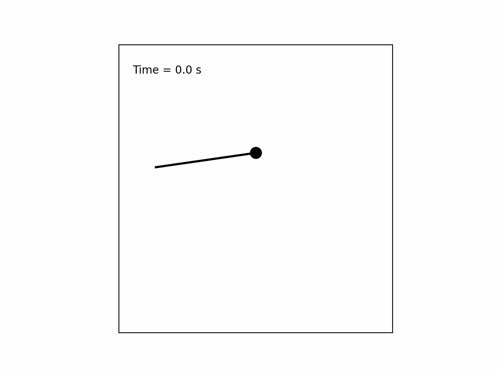
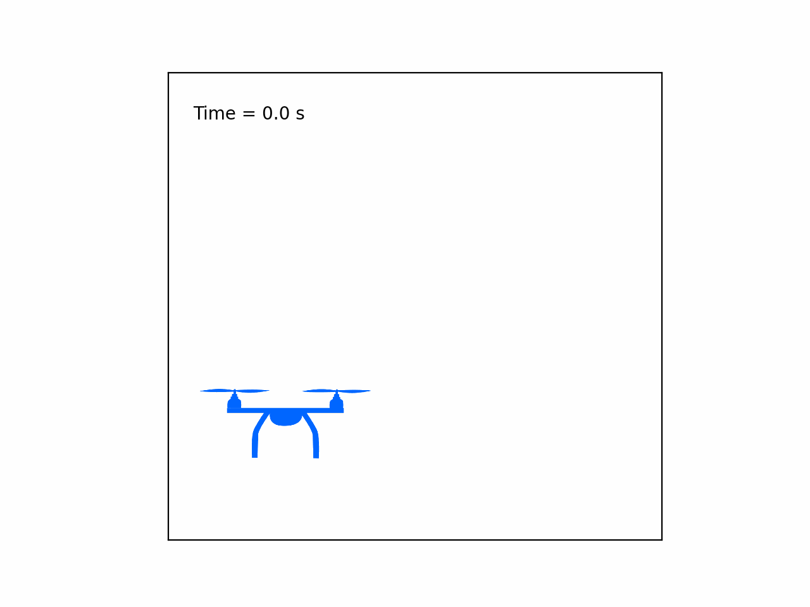

<link rel="stylesheet" href="https://maxcdn.bootstrapcdn.com/bootstrap/4.5.2/css/bootstrap.min.css">

    

        

            

                <a href="{{ site.baseurl }}/code/pendulum-simulation">
                    
                    

                        <h5 class="card-title">Pendulum</h5>
                    

                </a>
            

        

        

            

                <a href="{{ site.baseurl }}/code/cartpole-simulation">
                    
                    

                        <h5 class="card-title">Cart-Pole</h5>
                    

                </a>
            

        

        

            

                <a href="">
                    
                    

                        <h5 class="card-title">Planar Multirotor</h5>
                    

                </a>
            

        

    

